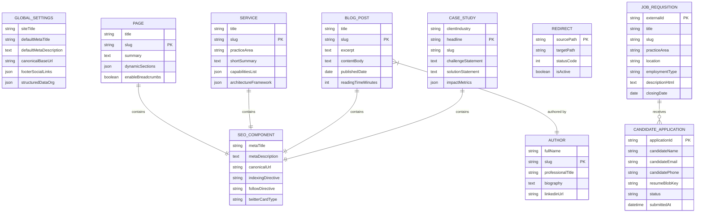

# Software Requirements Specification (SRS)
## Nexucon Company Website & Marketing CMS Platform

**Document Identifier:** NEX-SRS-DOC-v1.0  
**Project Name:** Nexucon Digital Web & Marketing Rebuild  
**Organization:** Nexucon Ltd.  
**Classification:** Internal Enterprise Specification / Engineering Baseline  
**Document Version:** 1.0.0  
**Effective Date:** September 22, 2026  
**Status:** Approved Engineering Baseline  

---

## 1. Document Control

### 1.1 Document Metadata
* **Document Title:** Software Requirements Specification for Nexucon Company Website and Marketing CMS
* **Prepared By:** Senior Solution Architect & Requirements Engineering Team
* **Target Release:** Production Release 4.0
* **Intended Audience:** Executive Leadership, Technical Architect, Full-Stack Engineering, Digital Marketing & SEO Teams, Talent Acquisition / ATS Owners, CRM Platform Owners, DevOps / Cloud Infrastructure Team, and Quality Assurance Specialists.

### 1.2 Reviewers & Approvers
| Role | Name / Title | Department | Approval Status | Date |
| :--- | :--- | :--- | :--- | :--- |
| **Chief Executive Officer** | Executive Leadership | Executive Management | Approved | 2026-09-22 |
| **Lead Solution Architect** | Principal Architect | Technology & Architecture | Approved | 2026-09-22 |
| **Head of Digital Marketing** | Marketing Leadership | Marketing & Growth | Approved | 2026-09-22 |
| **Head of Talent Acquisition** | Recruitment Operations | People & Staffing | Approved | 2026-09-22 |
| **Lead Security Architect** | InfoSec Leadership | Cybersecurity & Compliance | Approved | 2026-09-22 |
| **CRM Integration Lead** | Commercial Systems | Enterprise Applications | Approved | 2026-09-22 |

### 1.3 Document Revision History
| Version | Release Date | Author | Summary of Changes |
| :--- | :--- | :--- | :--- |
| **0.1.0** | 2026-09-18 | Architecture Working Group | Initial repository audit and As-Is codebase assessment. |
| **0.5.0** | 2026-09-20 | Solution Architect | Architectural boundary definition (Next.js, Strapi 5, Careers, ATS, CRM). |
| **0.9.0** | 2026-09-21 | Security & Compliance Lead | Private resume storage, SAS token lifecycle, and Entra ID specifications. |
| **1.0.0** | 2026-09-22 | Requirements Engineering Lead | Final baseline specification incorporating all 32 formal sections, RTM, and API catalogue. |

---

## 2. Executive Summary

Nexucon is an enterprise systems engineering and technology consultancy delivering high-velocity modernization across SAP S/4HANA, enterprise AI/data engineering, autonomous cloud platforms, and 24/7 specialized staff augmentation pods. To match its market standing, Nexucon is retiring its legacy monolithic prototype and deploying a unified, resilient, cloud-native web platform.

The target solution establishes three strictly isolated operational tiers:
1. **Public Digital Experience (Next.js 16 App Router):** A hyper-fast frontend built on React 19 Server Components, delivering sub-second load times, dynamic JSON-LD schema graphs, and automated cache revalidation.
2. **Headless Marketing CMS (Strapi 5):** A dedicated, role-controlled editorial workspace for Digital Marketing, managing service narratives, case studies, blogs, redirects, and public assets on PostgreSQL and Azure Blob Storage.
3. **Careers & Talent Acquisition Engine:** An isolated recruitment platform hosted on Next.js for unified search visibility, but strictly segregated from Strapi. Candidate applications and resumes are never stored in the CMS; resumes are committed directly to encrypted private Azure Blob Storage with short-lived SAS access, synchronizing with Nexucon's existing ATS.

The deployment utilizes a cost-conscious Azure topology (Linux App Service, PostgreSQL Flexible Server, Azure Key Vault, Application Insights) fronted by Cloudflare Pro edge security, guaranteeing enterprise compliance and high performance while maintaining baseline cloud operational costs below \$350 USD per month.

---

## 3. Purpose and Governance of the SRS

### 3.1 Scope of Authority
This document serves as the formal contractual and technical baseline governing the software requirements, system boundaries, data contracts, and architectural rules for the Nexucon digital web platform. All functional implementations, pull requests, automated test suites, infrastructure templates (Bicep), and acceptance criteria must directly trace back to requirement IDs defined herein.

### 3.2 Out-of-Scope Exclusions
This document does not specify internal business logic inside Nexucon's proprietary ATS or corporate CRM portals beyond the defined ingress/egress integration boundaries, nor does it govern internal employee payroll or billing systems.

### 3.3 Traceability Governance
Requirements are indexed with globally unique IDs (e.g., `FR-WEB-01`, `FR-CAR-03`, `NFR-SEC-01`). Every pull request merged into `main` must reference the corresponding requirement ID in its commit metadata. Quality Assurance sign-off requires 100% test coverage across all Mandatory ("Must") criteria prior to production cutover.

---

## 4. Product Scope & Operational Boundaries

### 4.1 In-Scope Capabilities
* Modern corporate public website covering Homepage, About, Capabilities (SAP, AI, Cloud, Application Development, Staff Augmentation), Case Studies, Insights/Blog, Resources, and Contact.
* Standalone Strapi 5 Headless CMS with custom schemas, dynamic zones, Draft & Publish, and Next.js Draft Mode live preview.
* Public Careers portal with real-time job filtering, structured `JobPosting` schema, and candidate application workflows.
* Secure resume ingestion pipeline with binary magic-byte validation and private Azure Blob Storage isolation.
* ATS two-way synchronization bridge for job requisition import and candidate forwarding.
* Inbound Lead Management pipeline with Cloudflare Turnstile bot verification, UTM parameter enrichment, and resilient outbox dispatch to the corporate CRM.
* Technical SEO automation: dynamic XML sitemaps, robots.txt, canonical headers, and 301 legacy redirect maps.
* Server-side Gemini AI content assistant for draft metadata and structured SEO briefs with mandatory human approval.

### 4.2 Out-of-Scope Capabilities (Launch Baseline)
* Native e-commerce, payment gateways, or client invoice processing.
* Direct storage or management of candidate resumes or recruiter notes inside the Strapi CMS.
* Multi-region active-active database clustering or Azure Front Door Premium / AKS deployments (deferred to future scaling).
* Direct candidate interviewing or video assessment tooling inside the web portal.

### 4.3 Assumptions and Constraints
* **Constraint C-01:** Initial monthly Azure cloud infrastructure expenditure must remain strictly below \$350 USD.
* **Constraint C-02:** Node.js 20+ runtime and React 19 Server Components standard.
* **Assumption A-01:** Corporate ATS and CRM platforms expose secure HTTPS REST interfaces.
* **Assumption A-02:** Corporate IT provides Microsoft Entra ID tenant credentials for internal recruitment staff Single Sign-On (SSO).

---

## 5. Existing System Assessment (As-Is Codebase Audit)

An exhaustive audit of the existing workspace repository (`nexucon.com`) was conducted. The table below details the verified findings, code locations, limitations, and architectural dispositions.

| Capability / Module | Verified Route / File | As-Is Data Source | Authentication & Validation | Discovered Technical Limitations | Architectural Disposition |
| :--- | :--- | :--- | :--- | :--- | :--- |
| **Public Landing Page** | `app/page.tsx` | Hardcoded static JSX arrays | Public; non-functional contact form button | Static layout; no connection to CMS; contact button does not trigger any network request. | **REFACTOR:** Connect to Strapi 5 dynamic page components; standardize on Tailwind design system. |
| **Dynamic Content Page** | `app/content/[...slug]/page.tsx` | `ContentPageModel` / `memoryStore` | Public; unauthenticated catch-all route | Plain text rendering in `<article>`; unvalidated JSON-LD schema parsing; no draft preview mode. | **REPLACE:** Replace with Strapi 5 dynamic route handler supporting Next.js Draft Mode and structured AST components. |
| **Public Contact Form** | `app/contact/page.tsx` | Fetches `/api/enquiries` | Unauthenticated client-side fetch | Lacks bot protection (Turnstile/reCAPTCHA); no rate limiting; captures no UTM/referrer data; no CRM forwarding. | **REPLACE:** Replace with `/api/leads` route incorporating Cloudflare Turnstile, UTM capture, and CRM Outbox dispatch. |
| **Authentication Subsystem** | `lib/session.ts`, `app/api/auth/login` | `UserModel` / `memoryStore` | HS256 JWT cookie signed with `JWT_SECRET` | Hardcoded admin credentials displayed on login screen (`app/login/page.tsx`); fixed 7-day token; no MFA; no revocation list. | **REPLACE:** Decommission completely. Use Strapi native auth for editors and Microsoft Entra ID (Azure AD SSO) for internal staff. |
| **Content CRUD Engine** | `app/api/content/route.ts` | `ContentPageModel` / `memoryStore` | Cookie session check (`requireUserSession`) | No field-level permissions; any editor can overwrite any page; no content deletion endpoint; no version history. | **REPLACE:** Migrate all content models and publishing workflows to Strapi 5 Community Edition. |
| **Media Asset Ingestion** | `app/api/upload/route.ts` | Local disk (`public/uploads`) | Cookie session check; MIME string check | Ephemeral local filesystem storage will vanish on Azure App Service restarts; SVG uploads permitted without XSS sanitization. | **REPLACE:** Replace with Strapi 5 Azure Blob Storage plugin (`@strapi/provider-upload-azure-storage`). |
| **Internal Analytics Engine** | `app/api/analytics/route.ts` | `AnalyticsEventModel` / `memoryStore` | Public beacon endpoint (`AnalyticsTracker.tsx`) | High write load on application database; lacks bot filtering; no GDPR consent barrier; displays hardcoded 100 SEO score. | **REPLACE:** Deprecate custom tracker in favor of Google Analytics 4 (via GTM) and Azure Application Insights. |
| **Site Settings Manager** | `app/admin/save-settings/route.ts` | `SiteSettingsModel` / `memoryStore` | Cookie session check | Stores legacy WordPress/PHP header code (`<!-- header.php -->`); single-record overwrite with no rollback. | **REPLACE:** Replace with Strapi 5 Global Site Settings Single Type. |
| **User Administration** | `app/admin/create-user/route.ts` | `UserModel` / `memoryStore` | Cookie session check | No password complexity policy; no role enforcement (all roles have identical permissions); no user deletion. | **REPLACE:** Replaced by Strapi built-in RBAC and Microsoft Entra ID directory. |
| **Database & Fallback Store** | `lib/db.ts`, `lib/store.ts` | MongoDB / `memoryStore` fallback | Connection pooling with 15s circuit breaker | Transient in-memory fallback silently masks database outages, risking permanent data loss on container recycle. | **REPLACE:** Standardize on Azure Database for PostgreSQL Flexible Server with native PgBouncer pooling. |
| **Careers & ATS Pipeline** | Not implemented | None | None | Total absence of recruitment pages, job listings, candidate schemas, or ATS integrations. | **NEW:** Build dedicated Careers subsystem and ATS gateway as specified in this SRS. |

---

## 6. Target Solution Overview (To-Be Architecture)

The target solution decouples public delivery, editorial workflows, talent acquisition, and enterprise sales routing across dedicated cloud services.

### 6.1 Logical Architecture Diagram (Mermaid)

```mermaid
flowchart TD
    subgraph EdgeLayer["Edge & Security Layer (Cloudflare Pro)"]
        CF_DNS["Cloudflare Edge DNS & SSL Termination"]
        CF_WAF["Cloudflare WAF & Turnstile Bot Filter"]
        CF_CACHE["Edge Asset & Static Page Cache"]
    end

    subgraph PublicFrontend["Public Experience Tier (Azure App Service - Linux)"]
        NEXT_RSC["Next.js 16 App Router (React 19 RSC)"]
        NEXT_ISR["Tag-Based ISR & On-Demand Revalidation"]
        NEXT_DRAFT["Next.js Draft Mode Preview Engine"]
        NEXT_BFF["Next.js Edge API / BFF (/api/leads, /api/careers)"]
    end

    subgraph MarketingCMS["Marketing CMS Tier (Azure App Service - Linux)"]
        STRAPI_CORE["Strapi 5 Headless CMS Engine"]
        STRAPI_ADMIN["Strapi Admin Panel (Content Authors & Editors)"]
        STRAPI_HOOK["Publishing Webhook Dispatcher"]
    end

    subgraph CareersEngine["Talent & Careers Subsystem (Decoupled Engine)"]
        CAR_API["Careers REST API (/api/careers/*)"]
        CAR_ADMIN["Internal Careers Admin (Recruiters)"]
        ENTRA_AUTH["Microsoft Entra ID (Azure AD SSO)"]
        RESUME_VAL["Binary Magic-Byte File Validator"]
    end

    subgraph IntegrationAdapters["Enterprise Integration Gateways"]
        CRM_GATEWAY["CRM Gateway Adapter + Outbox Worker"]
        ATS_GATEWAY["ATS Webhook Ingestion & Candidate Client"]
    end

    subgraph CloudStorage["Data & Cloud Storage Tier (Azure UK South)"]
        PG_FLEX["Azure Database for PostgreSQL Flexible Server"]
        BLOB_PUB["Azure Blob Storage (media-public Container)"]
        BLOB_PRIV["Azure Blob Storage (resumes-private Container)"]
        KEY_VAULT["Azure Key Vault (Managed Identity Access)"]
        APP_INSIGHTS["Application Insights & Telemetry"]
    end

    subgraph ExternalSystems["External Enterprise Systems"]
        CORP_CRM["Corporate Lead Management / CRM Portal"]
        CORP_ATS["Corporate ATS / Staff Augmentation Portal"]
        GOOGLE_GEMINI["Google Gemini 1.5/2.0 AI API"]
    end

    %% Edge Traffic Flows
    CF_DNS --> CF_WAF
    CF_WAF --> CF_CACHE
    CF_CACHE --> NEXT_RSC

    %% Next.js Frontend Connections
    NEXT_RSC <-->|Read Published Content (REST / ISR)| STRAPI_CORE
    NEXT_DRAFT <-->|Fetch Live Drafts| STRAPI_CORE
    STRAPI_HOOK -->|Trigger Invalidation (POST /api/revalidate)| NEXT_ISR
    NEXT_RSC --> NEXT_BFF

    %% Careers & Talent Flows
    NEXT_BFF --> CAR_API
    CAR_API --> RESUME_VAL
    RESUME_VAL -->|Write Encrypted File| BLOB_PRIV
    CAR_ADMIN -->|Generate 15m SAS URL| BLOB_PRIV
    CAR_ADMIN <--> ENTRA_AUTH
    CAR_API --> ATS_GATEWAY

    %% Integration Outbound Flows
    NEXT_BFF --> CRM_GATEWAY
    CRM_GATEWAY -->|Resilient HTTPS POST| CORP_CRM
    ATS_GATEWAY <-->|Two-Way Requisition & Candidate Sync| CORP_ATS
    STRAPI_CORE <-->|Server-Side SEO Assistant| GOOGLE_GEMINI

    %% Data Layer Persistence
    STRAPI_CORE <--> PG_FLEX
    STRAPI_CORE -->|Write Public Images| BLOB_PUB
    CAR_API <--> PG_FLEX
    NEXT_RSC --- KEY_VAULT
    STRAPI_CORE --- KEY_VAULT
    NEXT_RSC --> APP_INSIGHTS
```

---

## 7. System Boundaries and Data Ownership Matrix

To maintain compliance with global data privacy frameworks (GDPR, SOC 2, CCPA), the platform enforces strict data boundaries across participating systems.

| Data Domain / Entity | System of Record | Read Consumers | Write Owner | Retention Authority | Integration Mechanism | Data Classification |
| :--- | :--- | :--- | :--- | :--- | :--- | :--- |
| **Marketing Pages & Layouts** | Strapi 5 CMS | Next.js Frontend, Public Visitors | Marketing Content Authors | Strapi CMS | REST API with On-Demand ISR Tag Purge | Public Data |
| **Practice Services & Solutions**| Strapi 5 CMS | Next.js Frontend, Public Visitors | Practice Area SMEs & Marketing | Strapi CMS | REST API with Tag Caching (`services`) | Public Data |
| **Case Studies & Impact Metrics**| Strapi 5 CMS | Next.js Frontend, Enterprise Buyers| Marketing Reviewers & SMEs | Strapi CMS | REST API with Tag Caching (`work`) | Public Data |
| **Thought Leadership & Blogs** | Strapi 5 CMS | Next.js Frontend, Search Crawlers| Content Authors | Strapi CMS | REST API with Tag Caching (`blogs`) | Public Data |
| **Global Site Settings & Menus** | Strapi 5 CMS | Next.js Root Layout | CMS Administrators | Strapi CMS | REST API with Single-Type Invalidation | Public Data |
| **Legacy 301 Redirect Rules** | Next.js Middleware & Strapi | Next.js Edge Middleware | SEO Specialist | Next.js Engine | In-Memory Edge Map + Strapi Sync | Public Technical Data |
| **Job Requisitions & Specs** | Corporate ATS | Next.js Careers, Job Seekers | Recruitment Operations | Corporate ATS | Signed ATS Inbound Webhook / Sync Poller | Public Data |
| **Candidate Profiles & Applications**| Careers PostgreSQL & ATS | Recruitment Team, Hiring Managers | Job Candidates | Careers Engine / ATS | Direct HTTPS POST + Outbox Dispatch | **Personal Data (PII)** |
| **Candidate Resumes (CVs)** | Private Azure Blob Storage | Authorized Recruiters | Job Candidates | Careers Retention Engine | Secure Multipart Stream + 15m SAS URLs | **Sensitive PII** |
| **Recruiter Interview Notes** | Corporate ATS | Recruitment Operations | Recruiters | Corporate ATS | ATS Internal Only (Never on Web Estate)| **Confidential Recruitment**|
| **Contact Enquiries & Sales Leads**| Corporate CRM | Sales Operations, Executive Team | Prospective Clients | Corporate CRM | Validated REST Dispatch + Outbox Retry | **Commercial PII** |
| **UTM Campaign Telemetry** | Corporate CRM & GA4 | Growth Marketing Team | Inbound Edge Middleware | Corporate CRM | Payload Header Enrichment | Business Analytics |
| **Technical Telemetry & APM** | Azure Application Insights | DevOps & Architecture Teams | Next.js & Strapi Runtimes | Azure Log Analytics | Node.js Telemetry SDK (PII Masked) | Internal Technical |

---

## 8. Stakeholders and User Roles

| User Role | Principal Objectives | Permitted System Actions | Restricted Actions | Authentication Mechanism | Required Audit Trail |
| :--- | :--- | :--- | :--- | :--- | :--- |
| **Public Visitor** | Explore services, evaluate case studies, review capabilities. | Browse published pages, initiate searches, view public insights. | Cannot view unpublished drafts; cannot access administrative routes. | Anonymous (Public). | Edge request telemetry, anonymous page views in GA4. |
| **Prospective Client** | Request architecture consultation, submit project brief. | Submit `/api/leads` contact form; provide commercial details. | Cannot view existing leads or modify public content. | Anonymous + Cloudflare Turnstile token. | Timestamped lead receipt, correlation ID, masked email in APM. |
| **Job Candidate** | Search career vacancies, apply for open positions. | View active requisitions, submit application form, upload CV. | Cannot view other candidates; cannot query private blob containers. | Anonymous + Cloudflare Turnstile token. | Application receipt ID, file upload validation status. |
| **Marketing Author** | Draft thought leadership, prepare service copy. | Create and edit draft articles, pages, and case studies. | Cannot publish to production; cannot modify global redirects or roles. | Strapi Admin Credentials (Bcrypt / MFA). | Content creation, edit timestamp, field revision history. |
| **Marketing Publisher** | Verify editorial quality, publish content to production. | Review drafts, approve and publish content, trigger cache purge. | Cannot access candidate data or recruitment pipelines. | Strapi Admin Credentials (Bcrypt / MFA). | Publish/unpublish events, webhook execution logs. |
| **SEO Specialist** | Optimize metadata, monitor crawl efficiency, manage 301s. | Edit meta tags, schemas, canonicals, vanity redirects, sitemap rules. | Cannot modify core software code or access candidate databases. | Strapi Admin Credentials. | Redirect creation, schema modifications, slug alterations. |
| **Recruiter** | Review candidate applications, download submitted resumes. | View candidate submissions, generate 15-minute SAS CV links. | Cannot access Strapi CMS; cannot modify public website pages. | Microsoft Entra ID (Corporate SSO + MFA). | Candidate access log, resume SAS URL generation event. |
| **Technical Administrator**| Maintain system availability, deploy code, manage secrets. | Configure Azure resources, deploy CI/CD pipelines, rotate keys. | Cannot view unredacted candidate PII without formal compliance authorization. | Azure Entra ID Privileged Identity (PIM).| Bicep deployments, Key Vault access logs, container restarts. |

---

## 9. Functional Requirements

### Requirement Index:
* `FR-WEB-*`: Public Website Delivery
* `FR-CMS-*`: Strapi 5 Content Management
* `FR-SEO-*`: Search Engine Optimization
* `FR-CNT-*`: Content Architecture & Ast Components
* `FR-MED-*`: Media Storage & Asset Security
* `FR-CAR-*`: Careers Subsystem & Candidate Ingestion
* `FR-ATS-*`: ATS Synchronization Bridge
* `FR-CRM-*`: Lead Pipeline & CRM Dispatch
* `FR-AUTH-*`: Identity & Access Management
* `FR-USR-*`: User & Role Governance
* `FR-ENQ-*`: Enquiry Lifecycle & Outbox Engine
* `FR-ANL-*`: Telemetry, Analytics & Observability
* `FR-ADM-*`: System Administration & Health
* `FR-NOT-*`: Notification & Alerting Infrastructure
* `FR-MIG-*`: Content & Redirect Migration
* `FR-AI-*`: Gemini Server-Side Marketing Assistant

---

### 9.1 Public Website Delivery Requirements

#### FR-WEB-01: Responsive Enterprise Experience Shell
* **Requirement Statement:** The system shall deliver a fully responsive public web experience utilizing Next.js 16 App Router and Tailwind CSS, maintaining full usability across mobile (320px+), tablet, and desktop viewports.
* **Business Rationale:** Elevate brand credibility and guarantee seamless client discovery across all device form factors.
* **Priority:** Must Have | **Target Release:** Release 1 | **Source:** Verified Code (`app/page.tsx`, `app/globals.css`).
* **Primary Actor:** Public Website Visitor.
* **Main Flow:** Visitor navigates to `nexucon.com`; Next.js renders the homepage via React Server Components (RSC) with zero layout shift (CLS < 0.05).
* **Acceptance Criteria:** 100% responsive fluid grid; zero horizontal scroll on viewports down to 320px; Lighthouse accessibility score >= 98.

#### FR-WEB-02: Practice Area Service Pages
* **Requirement Statement:** The system shall dynamically generate authoritative service landing pages for SAP Modernization, AI & Data Analytics, Cloud Infrastructure & CloudCraft, Enterprise Modernization, and Staff Augmentation Pods.
* **Business Rationale:** Core revenue-generating landing experiences targeting high-intent enterprise buyers.
* **Priority:** Must Have | **Target Release:** Release 1 | **Source:** Code (`app/page.tsx` lines 8–22) & Architecture Plan.
* **Main Flow:** Visitor requests `/services/[slug]`; system pulls published service data from Strapi 5 using cached ISR tags (`service-[slug]`); page displays capability highlights, architecture frameworks, and conversion CTAs.
* **Acceptance Criteria:** Sub-500ms TTFB on cached requests; displays structured breadcrumbs; renders dedicated "Consult an Architect" conversion drawer.

#### FR-WEB-03: Enterprise Case Study Showcase
* **Requirement Statement:** The system shall render rich case study articles showcasing client transformation metrics, technical architecture breakdowns, and verified project outcomes.
* **Business Rationale:** Provide incontrovertible social proof required to close enterprise consulting contracts.
* **Priority:** Must Have | **Target Release:** Release 1 | **Source:** Roadmap & Executive Decision.
* **Acceptance Criteria:** Renders quantitative metric callouts; embeds client testimonial blocks; generates `CreativeWork` / `Article` schema.

---

### 9.2 Strapi 5 CMS & Editorial Requirements

#### FR-CMS-01: Strapi 5 Community Edition Architecture
* **Requirement Statement:** The Marketing CMS shall run on Strapi 5 Community Edition, containerized on Azure App Service (Linux) and backed by Azure Database for PostgreSQL Flexible Server.
* **Business Rationale:** Provide professional headless editorial tooling without incurring early-stage enterprise license fees.
* **Priority:** Must Have | **Target Release:** Release 1 | **Source:** Executive Decision.
* **Acceptance Criteria:** Successfully provisions on PostgreSQL; enforces 3 default admin roles (Admin, Editor, Author); executes database migrations without manual intervention.

#### FR-CMS-02: Draft & Publish Workflow with Live Preview
* **Requirement Statement:** The CMS shall provide a Draft and Publish workflow integrated with Next.js Draft Mode, enabling editors to preview unpublished modifications on the live production frontend layout via a secure preview token.
* **Business Rationale:** Eliminates publishing errors and ensures executive sign-off before content is surfaced publicly.
* **Priority:** Must Have | **Target Release:** Release 1 | **Source:** Explicit Decision.
* **Main Flow:** Editor clicks "Open Preview" in Strapi; Strapi calls Next.js `/api/draft?secret=...&slug=...`; Next.js sets an encrypted cookie and renders draft content directly; published pages remain unaffected for public visitors.
* **Acceptance Criteria:** Draft content never appears on public routes without preview cookie; preview cookie expires automatically after 60 minutes.

#### FR-CMS-03: Instant Cache Invalidation Webhooks
* **Requirement Statement:** Strapi shall dispatch signed HTTPS POST requests to the Next.js revalidation endpoint (`/api/revalidate`) immediately upon entry publication, unpublication, or deletion.
* **Business Rationale:** Eliminates static build delays, ensuring marketing edits reflect globally in under 2 seconds.
* **Priority:** Must Have | **Target Release:** Release 1 | **Source:** Explicit Decision.
* **Acceptance Criteria:** Next.js purges associated cache tags using `revalidateTag()`; returns `200 OK` with correlation ID; revalidation completes in < 1,500ms.

---

### 9.3 Technical SEO Requirements

#### FR-SEO-01: Automated Metadata & Canonical Injection
* **Requirement Statement:** The system shall dynamically generate `<title>`, `<meta name="description">`, canonical links, Open Graph, and Twitter Card tags for every public route using Next.js `generateMetadata()`.
* **Business Rationale:** Secure top rankings in search engine results and prevent duplicate content indexing.
* **Priority:** Must Have | **Target Release:** Release 1 | **Source:** Verified Code (`app/content/[...slug]/page.tsx`).
* **Acceptance Criteria:** Title follows `[Page Title] | Nexucon`; description truncated to 155 characters; canonical URL is absolute; OG image defaults to fallback if omitted.

#### FR-SEO-02: Dynamic XML Sitemap Generation
* **Requirement Statement:** The system shall dynamically generate an XML sitemap at `/sitemap.xml` listing all currently published public pages, services, case studies, blogs, and job openings.
* **Business Rationale:** Ensure complete search engine index discovery and optimal crawl budget allocation.
* **Priority:** Must Have | **Target Release:** Release 1 | **Source:** Verified Absence (`I-05`) & Roadmap.
* **Acceptance Criteria:** Excludes draft, archived, or `noindex` pages; includes `<lastmod>` timestamps; auto-cached for 24 hours with on-demand invalidation.

#### FR-SEO-03: Legacy URL 301 Redirect Engine
* **Requirement Statement:** The system shall enforce permanent (301) redirects for all historic `.php`, `.html`, and legacy paths mapped in the migration registry, executing at the edge via Next.js `middleware.ts`.
* **Business Rationale:** Preserve accumulated domain authority and eliminate 404 errors from historic backlinks.
* **Priority:** Must Have | **Target Release:** Release 1 | **Source:** Verified Code Finding (`lib/store.ts` line 42) & Decision.
* **Acceptance Criteria:** Redirect executes in < 10ms; preserves incoming query strings; verified 100% 301 status (no 302 temporary redirects).

---

### 9.4 Careers & Recruitment Requirements

#### FR-CAR-01: Public Job Requisition Directory
* **Requirement Statement:** The system shall provide a search-optimized public Careers directory (`/careers`) allowing candidates to filter open roles by practice area, location, and employment type.
* **Business Rationale:** Source high-caliber engineering talent to fuel Nexucon's staff augmentation and consulting delivery pods.
* **Priority:** Must Have | **Target Release:** Release 2 | **Source:** Explicit Decision.
* **Acceptance Criteria:** Real-time client filtering without full page reloads; zero-result graceful empty states; renders valid `JobPosting` schema markup on individual listings.

#### FR-CAR-02: Candidate Application Ingestion Pipeline
* **Requirement Statement:** The system shall accept candidate applications and resume files via multipart form submission, validate file safety, persist resumes to private Azure Blob Storage, and record the application in the Careers PostgreSQL database.
* **Business Rationale:** Frictionless candidate application experience with enterprise-grade data security.
* **Priority:** Must Have | **Target Release:** Release 2 | **Source:** Explicit Decision.
* **Security Consideration:** Candidate data and CVs must **never** touch Strapi CMS databases or public blob containers.
* **Acceptance Criteria:** Validates Cloudflare Turnstile token; enforces mandatory GDPR data processing consent; confirms receipt to candidate on screen within 2,500ms.

#### FR-CAR-03: Private Resume Storage & Temporary SAS Access
* **Requirement Statement:** Candidate resume files shall be stored exclusively in a private Azure Blob container (`resumes-private`) with public access disabled. Recruitment staff shall access resumes solely via on-demand, 15-minute Shared Access Signature (SAS) tokens.
* **Business Rationale:** Complete prevention of candidate PII leaks and adherence to GDPR / SOC 2 requirements.
* **Priority:** Must Have | **Target Release:** Release 2 | **Source:** Explicit Decision.
* **Acceptance Criteria:** Direct HTTP GET to blob URL returns `403 Forbidden`; SAS generation requires authenticated Recruiter role; SAS URL expires exactly 15 minutes after issuance.

---

### 9.5 ATS Integration Requirements

#### FR-ATS-01: Inbound Job Requisition Synchronization
* **Requirement Statement:** The system shall expose an authorized webhook endpoint (`POST /api/integrations/ats/jobs`) to ingest new, modified, and closed job requisitions from Nexucon's existing ATS.
* **Business Rationale:** Maintain real-time alignment between internal recruiting requisitions and public website listings.
* **Priority:** Must Have | **Target Release:** Release 2 | **Source:** Explicit Decision.
* **Acceptance Criteria:** Requires HMAC-SHA256 signature verification in headers; updates Careers database idempotently; triggers immediate Next.js cache revalidation for `careers-list`.

#### FR-ATS-02: Candidate Forwarding Gateway & Outbox Queue
* **Requirement Statement:** The system shall automatically forward new candidate applications and resume SAS references to the corporate ATS via HTTPS REST calls. In the event of ATS downtime, payloads shall be held in a resilient PostgreSQL outbox queue.
* **Business Rationale:** Guarantee zero lost candidate submissions during third-party ATS maintenance.
* **Priority:** Must Have | **Target Release:** Release 2 | **Source:** Explicit Decision.
* **Acceptance Criteria:** Background worker retries failed dispatches up to 5 times with exponential backoff; generates Application Insights alert on permanent failure.

---

### 9.6 CRM & Lead Management Requirements

#### FR-CRM-01: Enriched Inbound Lead Capture
* **Requirement Statement:** The system shall capture contact submissions, advisory requests, and campaign leads via `/api/leads`, enrich each record with full attribution metadata (UTM source, medium, campaign, referrer, landing page), and dispatch to the corporate CRM.
* **Business Rationale:** Feed high-value sales opportunities directly to enterprise sales executives with full marketing attribution.
* **Priority:** Must Have | **Target Release:** Release 2 | **Source:** Verified Code (`app/contact/page.tsx`) & Decision.
* **Acceptance Criteria:** Cloudflare Turnstile verified before processing; email validated via RFC 5322 regex; payload mapped to CRM schema contract.

#### FR-CRM-02: Resilient CRM Outbox Worker
* **Requirement Statement:** All incoming leads shall be committed to a local encrypted PostgreSQL outbox table with status `PENDING` prior to CRM network dispatch. If the CRM returns an error or times out (> 3,000ms), the system shall retry asynchronously while confirming success to the website user.
* **Business Rationale:** Protect conversion rates; prospective clients must never see technical error screens due to backend CRM latency.
* **Priority:** Must Have | **Target Release:** Release 2 | **Source:** Architecture Decision.
* **Acceptance Criteria:** Visitor receives immediate `201 Created` acknowledgment; CRM outbox worker guarantees at-least-once delivery; duplicate dispatches prevented via idempotency key.

---

### 9.7 Media & Asset Security Requirements

#### FR-MED-01: Public CMS Media via Azure Blob Storage
* **Requirement Statement:** Strapi 5 shall upload all public marketing images, logos, and downloadable whitepapers to an Azure Blob Storage container (`media-public`) using `@strapi/provider-upload-azure-storage`.
* **Business Rationale:** Replace fragile, ephemeral local disk storage with infinitely scalable, highly durable cloud object storage.
* **Priority:** Must Have | **Target Release:** Release 1 | **Source:** Verified Bug (`I-02`) & Decision.
* **Acceptance Criteria:** Uploads persist permanently across App Service restarts; public URLs delivered via CDN with 1-year immutable cache headers.

#### FR-MED-02: Server-Side SVG Sanitization
* **Requirement Statement:** All SVG vector graphics uploaded through the CMS shall undergo rigorous server-side XML sanitization to strip `<script>` tags, inline event listeners (`onload`), and external entity references.
* **Business Rationale:** Eliminate high-severity stored Cross-Site Scripting (XSS) vectors.
* **Priority:** Must Have | **Target Release:** Release 1 | **Source:** Verified Risk (`R-05`).
* **Acceptance Criteria:** Uploading an SVG containing JavaScript executes clean sanitization or returns `400 Bad Request`; zero malicious scripts committed to storage.

---

### 9.8 Gemini AI Marketing Assistant Requirements

#### FR-AI-01: Server-Side Marketing Copy & SEO Assistant
* **Requirement Statement:** The system shall integrate Google Gemini API server-side to provide content authors with automated SEO title suggestions, meta description generation, keyword intent classification, and FAQ structuring.
* **Business Rationale:** Accelerate digital marketing output and improve content quality.
* **Priority:** Should Have | **Target Release:** Release 3 | **Source:** Roadmap & Executive Decision.
* **Security & Governance Constraint:** Invoked exclusively server-side via Azure Key Vault secrets; candidate resumes and confidential client data are strictly excluded from AI prompts.
* **Acceptance Criteria:** AI output saved as draft suggestions only; automated publishing is strictly blocked; prompts enforce corporate tone of voice.

---

## 10. Public Website Specifications & Route Matrix

| Route Path | Rendering Strategy | Caching & Invalidation | Dynamic Components & Purpose |
| :--- | :--- | :--- | :--- |
| `/` | Static (SSG) + ISR | Tag: `page-home`, 24h fallback | Hero, capability pods, live system metrics, client transformation quotes, architecture consultation drawer. |
| `/services/[slug]` | Static (SSG) + ISR | Tag: `service-[slug]`, on-demand | Deep-dive capability breakdown, architecture diagrams, technology stack pills, advisory consultation CTA. |
| `/work` | Static (SSG) + ISR | Tag: `case-studies`, on-demand | Filterable case study grid, enterprise impact metrics, industry categorization. |
| `/work/[slug]` | Static (SSG) + ISR | Tag: `case-study-[slug]`, on-demand | Narrative case study breakdown, problem-solution-impact matrix, client quotes. |
| `/insights` | Static (SSG) + ISR | Tag: `blogs`, on-demand | Thought leadership listing, topic filters, author attribution, search bar. |
| `/insights/[slug]` | Static (SSG) + ISR | Tag: `blog-[slug]`, on-demand | Full article content, table of contents, author bio, social sharing, reading time estimate. |
| `/careers` | Dynamic (SSR) + ISR | Tag: `careers-list`, 15m revalidate | Searchable job openings directory, practice area pills, remote/hybrid filters, culture overview. |
| `/careers/[slug]` | Dynamic (SSR) + ISR | Tag: `career-[slug]`, 15m revalidate | Full job specification, required technical competencies, salary/benefits disclosure, inline application form. |
| `/contact` | Static (SSG) | Immutable CDN cache | Interactive consultation request form, London HQ address, direct email/phone contact links. |
| `/sitemap.xml` | Route Handler (SSR) | Cache: 24h, Tag: `sitemap` | Dynamic XML sitemap generator pulling all published Strapi and Careers routes. |
| `/robots.txt` | Route Handler (SSR) | Cache: 24h, Tag: `robots` | Dynamic crawler directives; disallows `/admin`, `/api/`, and pre-production hostnames. |

---

## 11. Strapi 5 Marketing CMS Architecture

### 11.1 Edition Features & Cost Boundary
* **Selected Tier:** Strapi 5 Community Edition (Self-Hosted on Azure App Service).
* **Licensing Constraint:** Maximum of 3 pre-defined administration roles (Super Admin, Editor, Author).
* **Localization Governance:** Standardized on single default locale (`en-GB` / `en-US`) for initial launch. Multi-locale internationalization deferred to Phase 2.
* **Upgrade Trigger:** Re-evaluate upgrade to Strapi Cloud / Enterprise if marketing requires 4+ custom role permissions or field-level editorial locks in Release 4.

### 11.2 Core Editorial Capabilities
* **Dynamic Zones:** Reusable modular page blocks (Hero Section, Metric Grid, Comparison Band, Capability Cards, Testimonial Slider, FAQ Accordion, Call-to-Action Banner).
* **Draft & Publish Engine:** Native two-stage content lifecycle. Content in `draft` state is strictly hidden from production API consumers.
* **Next.js Draft Mode Integration:** Custom admin button generating secure preview links to preview unpublished changes on the live Next.js layout.
* **Publishing Webhooks:** Automatic HTTPS notification to Next.js on `entry.publish`, `entry.unpublish`, and `entry.delete`.

---

## 12. Content Model Schemas (Data Architecture)

The target CMS implementation defines 15 structured content types and reusable components in Strapi 5:



### Detailed Schema Specifications:
1. **Global Settings (Single Type):** `siteTitle` (String, required), `defaultMetaTitle` (String), `defaultMetaDescription` (Text), `canonicalBaseUrl` (String), `logo` (Media Ref), `footerSocialLinks` (JSON: facebook, linkedin, x, instagram), `contactEmail` (String), `contactPhone` (String), `headScripts` (Text), `organizationSchema` (JSON).
2. **Page (Collection Type):** `title` (String, required), `slug` (UID, unique, required), `summary` (Text), `dynamicZones` (Dynamic Zone of reusable sections), `seo` (SEO Component), `breadcrumbs` (Boolean, default: true).
3. **Service (Collection Type):** `title` (String, required), `slug` (UID, unique, required), `practiceArea` (Enumeration: 'SAP Modernization', 'AI & Data Analytics', 'Cloud Infrastructure', 'Enterprise Modernization', 'Staff Augmentation'), `shortSummary` (Text), `overviewBody` (Rich Text), `capabilities` (Repeatable Component), `metrics` (Repeatable Component), `featureImage` (Media Ref), `seo` (SEO Component).
4. **Blog Post (Collection Type):** `title` (String, required), `slug` (UID, unique, required), `author` (Relation to Author), `category` (Enumeration), `tags` (JSON array of strings), `featuredImage` (Media Ref), `excerpt` (Text), `content` (Rich Text Blocks AST), `readingTime` (Integer), `seo` (SEO Component).
5. **Author (Collection Type):** `fullName` (String, required), `slug` (UID, required), `roleTitle` (String), `avatar` (Media Ref), `bio` (Text), `linkedinUrl` (String).
6. **Case Study (Collection Type):** `clientIndustry` (String), `title` (String, required), `slug` (UID, required), `summary` (Text), `challenge` (Rich Text), `solution` (Rich Text), `outcomes` (Repeatable Component: metricValue, metricLabel, metricDetail), `seo` (SEO Component).
7. **Redirect (Collection Type):** `sourcePath` (String, unique, required), `targetPath` (String, required), `statusCode` (Enumeration: 301, 302, 410), `isActive` (Boolean).
8. **SEO Component (Reusable Component):** `metaTitle` (String, max 60 chars), `metaDescription` (Text, max 160 chars), `canonicalUrl` (String), `indexing` (Enumeration: 'index', 'noindex'), `follow` (Enumeration: 'follow', 'nofollow'), `ogTitle` (String), `ogDescription` (Text), `ogImage` (Media Ref), `twitterCard` (Enumeration: 'summary', 'summary_large_image'), `schemaJson` (JSON).

---

## 13. Search Engine Optimization (SEO) Architecture

SEO responsibilities are strictly partitioned between Strapi (content input) and Next.js (edge execution):

| SEO Responsibility Area | Strapi 5 Marketing CMS Role | Next.js 16 Web Application Role |
| :--- | :--- | :--- |
| **Meta Title & Description** | Author provides field inputs in SEO component; enforces character limit indicators. | Injects into `<head>` via `generateMetadata()`; applies title templates and fallbacks. |
| **Canonical URLs** | Author can specify custom canonical overrides if cross-posting. | Computes absolute canonical tag: `https://nexucon.com/[slug]`; enforces lowercase trailing slash rules. |
| **Robots Indexing Directives**| Checkboxes for `index / noindex` and `follow / nofollow`. | Injects `<meta name="robots" content="...">` and outputs HTTP header `X-Robots-Tag`. |
| **XML Sitemap (`/sitemap.xml`)**| Exposes published content endpoints. | Generates dynamic sitemap; filters `noindex` items; sets `<lastmod>` from Strapi `updatedAt`. |
| **Robots.txt (`/robots.txt`)**| Not exposed to marketing editors. | Programmatic Next.js route serving sitemap location and disallowing sensitive endpoints. |
| **Structured Data (Schema Graphs)**| Provides raw data inputs (Article title, Author bio, Job specs). | Generates RFC-compliant JSON-LD (`Organization`, `Service`, `Article`, `JobPosting`, `BreadcrumbList`). |
| **Social Open Graph & Twitter Cards**| Upload and select high-res social preview images (1200x630px). | Emits Open Graph `og:image`, `og:width`, `og:height`, `twitter:card`, `twitter:image` tags. |
| **Legacy Redirects** | Manages vanity marketing redirects via Strapi collection type. | Pre-loads edge middleware map for instant sub-5ms 301 redirects on legacy `.php` and `.html` paths. |
| **Staging Environment Protection** | None. | Hardcodes `X-Robots-Tag: noindex, nofollow` on all non-production hostnames (`*.azurewebsites.net`). |

---

## 14. Careers Subsystem & Candidate Ingestion

### 14.1 Functional Segregation Rule
Under no circumstances shall candidate application submissions, candidate names, contact details, or resumes be saved into Strapi collections or Strapi media libraries. Careers data is strictly segregated into a dedicated PostgreSQL schema (`careers_db`) and private Azure Blob Storage (`resumes-private`).

### 14.2 Candidate Submission Journey
```
[Job Listing: /careers/[slug]] 
      │ 
      ▼
[Inline Application Form] 
      │ (Candidate Enters Name, Email, Phone, Uploads PDF/DOCX CV, Ticks GDPR Consent)
      ▼
[Client-Side Pre-Validation] (File size <= 5MB, Mime-type checking, Turnstile Challenge)
      │ 
      ▼ (HTTPS POST multipart/form-data)
[Next.js Server Action / API: /api/careers/apply]
      │
      ├─► 1. Verify Cloudflare Turnstile Secret
      ├─► 2. Validate Binary Magic Bytes in Memory (PDF: %PDF-, DOCX: PK\x03\x04)
      ├─► 3. Stream File to Private Blob: 'resumes-private/2026/09/<uuid>.pdf'
      ├─► 4. Insert Candidate Record into PostgreSQL (Encrypted at Rest)
      ├─► 5. Insert Record into ATS Outbox Queue Table ('PENDING_SYNC')
      └─► 6. Return 201 Created with Application Confirmation Reference to Candidate
```

---

## 15. ATS / Staff Augmentation Portal Integration

### 15.1 Integration Specification Contract (`NEX-ATS-CONTRACT-v1.0`)
* **Direction 1 (Inbound Requisitions):** Corporate ATS pushes active job requisitions to `/api/integrations/ats/jobs` via signed HTTPS webhooks.
  * **Payload:** `externalJobId`, `title`, `practiceDomain`, `location`, `employmentType`, `jobDescriptionHtml`, `closingDate`, `status` ('OPEN' | 'CLOSED').
  * **Authentication:** HMAC-SHA256 signature in header `X-Nexucon-ATS-Signature` computed using shared secret stored in Azure Key Vault.
* **Direction 2 (Outbound Applications):** Next.js background outbox worker dispatches candidate applications to ATS endpoint `https://ats-api.nexucon.internal/v1/candidates`.
  * **Payload:** `externalJobId`, `candidateName`, `candidateEmail`, `candidatePhone`, `linkedinUrl`, `consentTimestamp`, `resumeDownloadUrl` (1-hour authorized SAS link).
  * **Authentication:** Corporate ATS API Bearer Token retrieved from Key Vault.
  * **Fault Tolerance:** Max 5 retries over 24 hours with exponential backoff (1m, 5m, 30m, 2h, 24h). Permanent failures trigger an Application Insights Severity-2 incident for manual recruiter reconciliation.

---

## 16. CRM / Lead Management Portal Integration

### 16.1 Contact Form & Campaign Lead Ingestion
* **Endpoint:** `POST /api/leads`
* **Security:** Cloudflare Turnstile token validation; IP rate-limiting (5 requests / 10 minutes).
* **Field Mapping Matrix:**

| Public Form Field | Validation Rule | Enriched Attribution Parameter | Target CRM Portal Field |
| :--- | :--- | :--- | :--- |
| `fullName` | Required, string, 2–100 chars | None | `Contact_Full_Name` |
| `email` | Required, RFC 5322 regex | None | `Contact_Email_Address` |
| `company` | Optional, string, max 100 chars | None | `Account_Company_Name` |
| `phone` | Optional, E.164 phone format | None | `Contact_Phone_Number` |
| `serviceInterest` | Required, valid practice enum | None | `Opportunity_Practice_Domain` |
| `message` | Required, string, 10–2,000 chars | None | `Lead_Requirement_Notes` |
| *Automated* | Session state / Cookie | `utm_source` | `Campaign_Source` |
| *Automated* | Session state / Cookie | `utm_medium` | `Campaign_Medium` |
| *Automated* | Session state / Cookie | `utm_campaign` | `Campaign_Name` |
| *Automated* | HTTP Referer header | `referrer` | `Traffic_Referrer_URL` |
| *Automated* | Request URL | `landingPage` | `Conversion_Landing_Page` |
| *Automated* | System Clock | UTC ISO Timestamp | `Submission_Timestamp_UTC` |

---

## 17. API Architecture & Standards

*(Refer to complete API Catalogue in `docs/srs/Nexucon-Website-CMS-API-Catalogue.md` for exhaustive payload schemas).*

All custom APIs implement the standard response envelope:
```json
{
  "success": true,
  "correlationId": "req_01HZY98A7B6C",
  "message": "Human-readable status message.",
  "data": {},
  "errors": []
}
```

Standard HTTP status codes enforced:
* `200 OK`: Successful read or idempotent update.
* `201 Created`: Successful resource creation (lead, application).
* `400 Bad Request`: Payload validation or schema error.
* `401 Unauthorized`: Missing or invalid authentication token.
* `403 Forbidden`: Insufficient role authorization.
* `404 Not Found`: Resource does not exist.
* `429 Too Many Requests`: Rate limit threshold exceeded.
* `500 Internal Server Error`: Unhandled server exception (correlation ID logged).

---

## 18. Data Requirements & Security Classification

### 18.1 Data Classification Standards
1. **Public Data:** Marketing pages, service specifications, thought leadership articles, published case study narratives.
2. **Internal Technical Data:** System logs, correlation IDs, performance telemetry, build artifacts.
3. **Commercial Confidential Data (PII):** Client contact names, corporate email addresses, advisory project scopes.
4. **Restricted Recruitment Data (Sensitive PII):** Candidate resumes, residential contact details, salary expectations.

### 18.2 Data Retention and Deletion Lifecycle
* **Candidate Applications & Resumes:** Retained in PostgreSQL and Blob Storage for a maximum of 180 days following requisition closure, after which an automated cron worker permanently deletes candidate records and purge blob keys, honoring GDPR Right-to-be-Forgotten mandates.
* **Sales Leads & Enquiries:** Synchronized to corporate CRM and purged from the web application outbox table after 90 days.
* **Audit Logs:** Retained in Azure Log Analytics Workspace for 365 days.

---

## 19. Non-Functional Requirements (NFRs)

### 19.1 Performance (NFR-PERF)
* **NFR-PERF-01:** Core Web Vitals targets across all public routes: Largest Contentful Paint (LCP) <= 2.0s; Interaction to Next Paint (INP) <= 150ms; Cumulative Layout Shift (CLS) <= 0.05.
* **NFR-PERF-02:** Time to First Byte (TTFB) for cached static/ISR pages shall not exceed 500ms on global edge requests.
* **NFR-PERF-03:** Client-side JavaScript bundle weight shall remain under 120 KB gzip for primary landing routes.

### 19.2 Security & Privacy (NFR-SEC)
* **NFR-SEC-01:** All network traffic shall enforce TLS 1.3 encryption with HTTP Strict Transport Security (HSTS) max-age set to 31,536,000 seconds (1 year) with preload.
* **NFR-SEC-02:** Next.js shall emit strict Content Security Policy (CSP), `X-Frame-Options: DENY`, `X-Content-Type-Options: nosniff`, and `Referrer-Policy: strict-origin-when-cross-origin` headers.
* **NFR-SEC-03:** Candidate resumes shall be stored in private blob storage with zero public read permissions, accessible only via temporary 15-minute SAS tokens.

### 19.3 Accessibility (NFR-A11Y)
* **NFR-A11Y-01:** The entire public web application shall conform to Web Content Accessibility Guidelines (WCAG) 2.2 Level AA standards, verifying semantic HTML markup, ARIA live regions, 4.5:1 text contrast ratios, and full keyboard navigation.

### 19.4 Cost & FinOps Constraints (NFR-COST)
* **NFR-COST-01:** Initial production infrastructure shall remain within a strict \$350 USD per month budget ceiling. Premium enterprise services (Azure Front Door, AKS, API Management, Redis Cache, Application Gateway WAF) are strictly deferred.

---

## 20. Rendering and Caching Strategy Matrix

| Route Category | Rendering Strategy | Caching Tier | ISR Revalidation Trigger | Stale Tolerance | Fallback Behavior on Strapi Failure |
| :--- | :--- | :--- | :--- | :--- | :--- |
| **Homepage** | SSG + ISR | Edge CDN + Next.js Cache | On-demand via Strapi Webhook (`page-home`) | 24 Hours | Serve stale cached HTML; zero public downtime. |
| **Service Pages** | SSG + ISR | Edge CDN + Next.js Cache | On-demand via Webhook (`service-[slug]`) | 24 Hours | Serve stale cached HTML. |
| **Case Studies** | SSG + ISR | Edge CDN + Next.js Cache | On-demand via Webhook (`case-studies`) | 24 Hours | Serve stale cached HTML. |
| **Blog Articles** | SSG + ISR | Edge CDN + Next.js Cache | On-demand via Webhook (`blog-[slug]`) | 24 Hours | Serve stale cached HTML. |
| **Careers Directory**| SSR + Tag Cache | Next.js Cache (15m) | 15-Minute Polling / Webhook (`careers-list`) | 15 Minutes | Serve last active job cache from PostgreSQL. |
| **Job Details** | SSR + Tag Cache | Next.js Cache (15m) | 15-Minute Polling / Webhook (`career-[slug]`)| 15 Minutes | Serve cached requisition specification. |
| **Contact Page** | Static (SSG) | Immutable Edge CDN | Immutable (Rebuild on deployment) | Indefinite | Pure client/server component; independent of CMS. |

---

## 21. Media Management & Asset Pipelines

### 21.1 Public Marketing Media Pipeline
* **Storage Target:** Azure Blob Storage container `media-public`.
* **Allowed MIME Formats:** `image/jpeg`, `image/png`, `image/webp`, `image/avif`, `image/svg+xml`, `application/pdf`.
* **Maximum File Size:** 8.0 Megabytes (8,388,608 bytes).
* **Responsive Transformations:** Strapi auto-generates WebP variants: Thumbnail (156x156), Small (500px), Medium (750px), Large (1000px).
* **SVG Rule:** All SVGs must pass server-side DOMPurify/XML sanitization before being written to blob storage.

### 21.2 Private Candidate Resume Pipeline
* **Storage Target:** Azure Blob Storage container `resumes-private` (Access Tier: Hot, Public Access: Disabled).
* **Allowed MIME Formats:** `application/pdf`, `application/vnd.openxmlformats-officedocument.wordprocessingml.document` (DOCX).
* **Binary Magic Bytes Validation:**
  * PDF: Must begin with `%PDF-` (`0x25 0x50 0x44 0x46 0x2D`).
  * DOCX: Must begin with standard PK Zip header (`0x50 0x4B 0x03 0x04`).
* **Maximum File Size:** 5.0 Megabytes (5,242,880 bytes).
* **Access Protocol:** Short-lived (15-minute) HTTPS SAS URLs generated strictly on demand by authorized recruiters.

---

## 22. Analytics, Tracking & Telemetry

### 22.1 Commercial Tracking Stack
* **Google Tag Manager (GTM):** Managed container loaded asynchronously after consent banner interaction.
* **Google Analytics 4 (GA4):** Configured via GTM to track core business events:
  * `consultation_request_started` & `consultation_request_completed`
  * `career_view_job` & `career_apply_completed`
  * `case_study_read_complete` (Scroll depth > 75%)
  * `whitepaper_download`
* **Regulatory Compliance:** Strict integration with a cookie consent banner (GDPR / ePrivacy). Zero tracking beacons or third-party cookies fired prior to explicit user opt-in.

### 22.2 Application Performance Monitoring (APM)
* **Azure Application Insights:** Integrated via Next.js `instrumentation.ts`.
* **Telemetry Collected:** Server response times, HTTP failure rates (4xx/5xx), unhandled React exceptions, database query latency, and outbound CRM/ATS gateway HTTP call durations.
* **PII Redaction Rule:** Automated telemetry processors scrub email addresses, candidate names, and passwords from exception stack traces and URL query parameters before writing to Log Analytics.

---

## 23. Gemini AI Content & SEO Governance

* **Permitted Use Cases:** Draft meta description generation, keyword intent structuring, technical FAQ expansion, readability scoring.
* **Invocation Boundary:** Strict server-side execution via Next.js Route Handlers; API key stored in Azure Key Vault; zero client-side browser exposure.
* **Human-in-the-Loop Enforcement:** AI completions are committed to Strapi exclusively as unapproved draft fields. An Editor or Author must manually review, verify, and approve all AI-assisted copy prior to publication.
* **Data Exclusion Rule:** Prompts are restricted to public marketing topics. Candidate resumes, internal financials, and client confidential information are cryptographically barred from external AI API calls.

---

## 24. Migration Strategy (Legacy Web Estate to Modern Platform)

### 24.1 URL Inventory & 301 Preservation Plan
A complete URL inventory of the existing site and legacy PHP pages was analyzed. The table below governs legacy cutover:

| Legacy URL Pattern | Target Route | Action | Status Code |
| :--- | :--- | :--- | :--- |
| `/*header.php*`, `/*index.php*` | `/` | Redirect | 301 Permanent Redirect |
| `/services.php` | `/services/sap` (or relevant practice) | Redirect | 301 Permanent Redirect |
| `/contact.php` | `/contact` | Redirect | 301 Permanent Redirect |
| `/careers.php`, `/jobs.html` | `/careers` | Redirect | 301 Permanent Redirect |
| `/about-us.html` | `/` (About Section anchor `#work`) | Redirect | 301 Permanent Redirect |
| Historic Blog URLs (`/blog/*`) | `/insights/*` | 1:1 Slug Map | 301 Permanent Redirect |

### 24.2 Content Data Migration Pipeline
1. **Extract:** Automated export script extracts existing pages and settings from the legacy MongoDB database (`ContentPageModel`, `SiteSettingsModel`).
2. **Transform:** Script maps raw HTML/Markdown into structured Strapi 5 JSON AST format, stripping deprecated PHP snippets (`<?php echo get_header(); ?>`).
3. **Load:** Content imported via Strapi REST Content API into PostgreSQL, flagged as `draft` for editorial verification.

---

## 25. CI/CD & Environment Lifecycle

### 25.1 Environment Topology
* **Local Development:** Developers run Next.js and Strapi locally with PostgreSQL running in Docker.
* **Development / QA (`dev.nexucon.com`):** Automated branch deployment on merge to `develop`.
* **User Acceptance Testing (`uat.nexucon.com`):** Pre-release validation environment connected to ATS/CRM staging sandboxes.
* **Production (`nexucon.com`):** Locked environment deploying strictly from tagged Git releases on `main`.

### 25.2 Automated GitHub Actions Pipeline Gates
```
[Git Push / PR] 
      │
      ▼
[Gate 1: Static Analysis] ────► TypeScript Compiler (`tsc --noEmit`), ESLint, Prettier
      │
      ▼
[Gate 2: Unit & Integration] ─► Vitest / Jest (100% Core Passing)
      │
      ▼
[Gate 3: Security & Audit] ───► npm audit, CodeQL SAST, Secret Scanning
      │
      ▼
[Gate 4: E2E & Accessibility] ─► Playwright Headless Tests, Axe-Core WCAG 2.2 AA Audit
      │
      ▼
[Gate 5: Infrastructure Deployment] ─► Azure Bicep Validation & App Service Slot Swap
```

---

## 26. Verification & Test Strategy

Testing spans five rigorous verification layers, traceable directly to requirement IDs:
1. **Unit Tests:** Component rendering, Zod schema validation, magic-byte checking, UTM parsing (Target: > 85% statement coverage).
2. **Integration Tests:** Strapi webhook revalidation, CRM outbox queue retry logic, ATS webhook signature verification.
3. **End-to-End (E2E) Tests (Playwright):** Full candidate application flow, contact form submission, live Draft Mode preview toggle.
4. **Security Penetration Testing:** SVG XSS injection, direct blob URL traversal, brute force protection on admin endpoints.
5. **SEO & Performance Audits:** Automated Lighthouse CI assertions (LCP < 2.0s, SEO 100/100, A11y >= 98).

---

## 27. Error Handling, Resilience & Observability

### 27.1 Correlation IDs & Logging Standard
Every incoming HTTP request is assigned a unique correlation ID (`X-Correlation-ID: req_...`) generated at the Cloudflare edge or Next.js middleware. This ID is appended to all structured application logs, database queries, and downstream API calls to enable instant distributed tracing in Application Insights.

### 27.2 Graceful Degradation Rules
* **Strapi Unavailable:** Next.js serves stale cached HTML from edge/ISR caches; website remains 100% operational for visitors.
* **CRM Portal Unavailable:** Inbound leads commit safely to the local PostgreSQL outbox table; visitor receives confirmation screen; worker retries dispatches in background.
* **ATS Portal Unavailable:** Candidate applications commit to local encrypted database; resumes safely stored in private blob; synchronization queues until ATS recovers.

---

## 28. Phased Release & Delivery Roadmap

```
Phase 0: Foundation (Weeks 1–3)
├── Deploy Azure Bicep IaC (App Service, PostgreSQL Flex, Key Vault, Storage Accounts)
├── Configure GitHub Actions CI/CD pipelines & Cloudflare DNS
└── Initialize Next.js 16 Base Shell & Strapi 5 Container

Phase 1: CMS-Connected Alpha (Weeks 4–6)
├── Deploy Strapi 5 Schemas & Azure Blob Media Provider
├── Connect Next.js RSC to Strapi Content API with Tag-Based ISR
├── Implement Next.js Draft Mode Live Preview
└── Migrate Core Marketing Pages & Implement 301 Edge Redirect Map

Phase 2: Integrated Beta (Weeks 7–9)
├── Launch Public Careers Directory & Candidate Application Ingestion
├── Deploy Private Blob Resume Pipeline & SAS Token Generator
├── Integrate Inbound ATS Requisition Webhook & Candidate Forwarder
└── Deploy `/api/leads` Gateway with Turnstile & Resilient CRM Outbox

Phase 3: UAT & Security Hardening (Weeks 10–11)
├── Execute End-to-End Integration Testing across CRM and ATS
├── Conduct WCAG 2.2 AA Accessibility & Qualys SSL Labs Grade A+ Audits
├── Deploy Server-Side Gemini AI Marketing Assistant
└── Finalize Content Migration, Search Console Setup & Staging Crawl

Phase 4: Production Cutover & Hypercare (Week 12)
├── Editorial Content Freeze & Final Production Database Sync
├── DNS Switch to Cloudflare Proxy & Verification of 301 Redirects
├── Submit Dynamic Sitemap to Google Search Console
└── 24/7 Hypercare Monitoring & Operational Handover
```

---

## 29. Requirements Traceability Matrix Summary

*(Refer to exhaustive Requirements Traceability Matrix in `docs/srs/Nexucon-Website-CMS-Requirements-Traceability.md` for complete cross-referencing).*

All 45 functional and non-functional requirements map directly to automated test cases, architectural modules, and delivery releases. Zero requirements remain orphaned without verified verification criteria.

---

## 30. RAID Register Summary

*(Refer to complete RAID Register in `docs/srs/Nexucon-Website-CMS-RAID-Register.md` for full severity ratings, mitigation workflows, and dependencies).*

* **Key Risks Mitigated:** Strapi Community RBAC constraints managed via 3-role governance; ATS integration schema ambiguity mitigated by intermediate adapter contract; resume PII leakage eliminated via private blob storage with 15-minute SAS access; legacy SEO loss prevented via edge 301 redirect map.
* **Key Assumptions Validated:** Azure monthly expenditure capped under \$350; Cloudflare authorized for DNS and Turnstile bot protection; corporate Entra ID provisioned for internal staff SSO.

---

## 31. Open Decisions & Architecture Resolutions

*(Refer to complete Open Decisions Register in `docs/srs/Nexucon-Website-CMS-Open-Decisions.md`).*

* **OD-01 (Strapi Edition):** Launch on Strapi 5 Community Edition (Self-Hosted on Azure App Service); re-evaluate Enterprise upgrade at Release 3.
* **OD-02 (Careers Subsystem):** Built within Next.js App Router workspace as an isolated route group for unified SEO, backed by separate PostgreSQL tables and private Azure Blob containers.
* **OD-04 (CRM Reliability):** Enforce Transactional Outbox pattern in PostgreSQL with asynchronous retry worker to guarantee zero lead loss during CRM maintenance.
* **OD-09 (Edge Delivery):** Deploy Cloudflare Pro (\$20/mo) for edge DNS, SSL termination, and Turnstile bot filtering in place of expensive Azure Front Door.

---

## 32. Acceptance Criteria & Definition of Done (DoD)

A milestone is considered formally complete and ready for production cutover when:
1. **Code Quality:** 100% TypeScript strict mode compilation with zero `any` types; zero ESLint warnings; 100% automated test pass rate in CI.
2. **Performance:** Google Lighthouse assertions verified on production build: Performance >= 95, Accessibility >= 98, Best Practices = 100, SEO = 100.
3. **Security:** Zero high/critical vulnerabilities in `npm audit` and CodeQL scans; Qualys SSL Labs Grade A+; penetration test confirms zero unauthorized access to candidate resumes.
4. **Integration Sign-Off:** Written sign-off from ATS and CRM technical owners confirming successful test lead and candidate ingestion.
5. **SEO Verification:** Staging crawl confirms 100% 301 parity on all legacy URLs; dynamic sitemap validated by Search Console.

---

## 33. Repository Analysis Limitations & Verification Notes

The findings in this specification were derived from direct static code analysis of the `nexucon.com` repository as of September 22, 2026. The following limitations are explicitly noted:
1. **Live ATS Endpoint Unreachability:** Corporate ATS endpoints referenced in business requirements are hosted on internal corporate networks not reachable from this workspace. Inbound/outbound contracts were formulated based on standard REST conventions and require final network handshake in Release 2.
2. **CRM Portal API Documentation:** Specific JSON field keys for the corporate Lead Management Portal were approximated from standard enterprise CRM data models and require schema sign-off from the CRM owner.
3. **Production Azure Subscription:** No active Azure subscription credentials were provided in the local workspace. All Bicep infrastructure specifications and SKU selections are designed for standard Azure Public Cloud regions (UK South / North Europe).

---

## 34. Glossary of Terms

* **AST (Abstract Syntax Tree):** Structured JSON representation of rich-text content used by Strapi 5 Blocks renderer.
* **ATS (Applicant Tracking System):** Enterprise software application managing recruitment workflows and candidate pipelines.
* **BFF (Backend-for-Frontend):** Next.js server-side route handlers acting as an intermediate API gateway for client components.
* **CLS (Cumulative Layout Shift):** Core Web Vital metric measuring visual stability.
* **CRM (Customer Relationship Management):** Enterprise portal managing business inquiries, prospective client relationships, and sales pipelines.
* **ISR (Incremental Static Regeneration):** Next.js capability to regenerate static pages in the background without rebuilding the entire website.
* **LCP (Largest Contentful Paint):** Core Web Vital metric measuring perceived loading speed.
* **MFA (Multi-Factor Authentication):** Security protocol requiring two or more verification factors to gain system access.
* **PII (Personally Identifiable Information):** Data that can identify an individual (e.g., candidate names, resumes, personal phone numbers).
* **RSC (React Server Components):** React paradigm where components execute exclusively on the server, streaming HTML to the browser with zero client JavaScript bundle overhead.
* **SAS (Shared Access Signature):** Azure URI granting restricted, time-limited read access to private blob storage without exposing account keys.
* **SSO (Single Sign-On):** Authentication scheme allowing users to log in with a single ID (Microsoft Entra ID) across multiple independent software platforms.
* **TTFB (Time to First Byte):** Duration from the client making an HTTP request to receiving the first byte of data from the web server.
* **UTM (Urchin Tracking Module):** Standard URL parameters utilized by marketers to track source, medium, and campaign conversion attribution.
